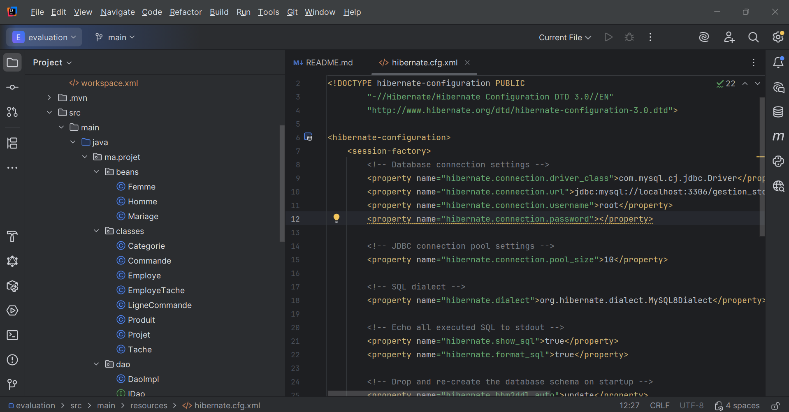
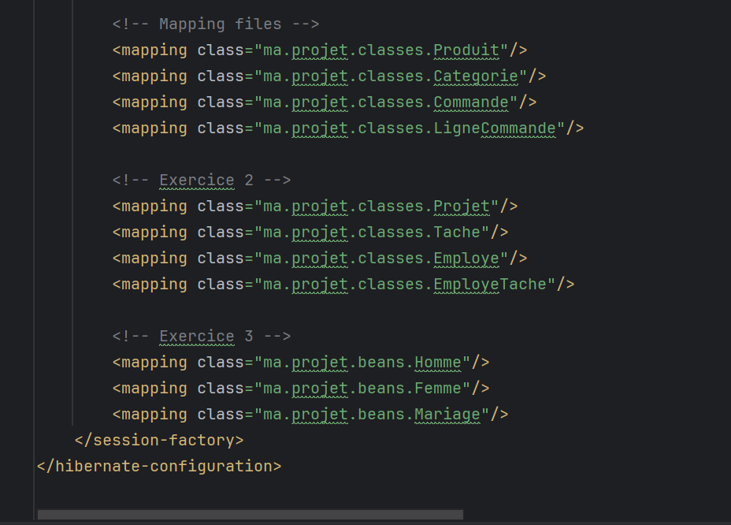

# Projet d'Évaluation Hibernate

Ce projet contient trois exercices d'application de gestion utilisant Hibernate/JPA.

## Structure du Projet

```
evaluation/
├── pom.xml                          # Configuration Maven
├── src/
│   ├── main/
│   │   ├── java/
│   │   │   └── ma/projet/
│   │   │       ├── beans/           # Entités Exercice 3 (Homme, Femme, Mariage)
│   │   │       ├── classes/        # Entités Exercices 1 & 2
│   │   │       ├── dao/            # Interface IDao et implémentation
│   │   │       ├── service/        # Services métier
│   │   │       └── util/          # HibernateUtil
│   │   └── resources/
│   │       ├── application.properties
│   │       └── hibernate.cfg.xml
│   └── test/
│       └── java/
│           └── ma/projet/test/     # Classes de test
```

## Configuration

### Base de données MySQL

1. Assurez-vous que MySQL est installé et en cours d'exécution
2. Modifiez les paramètres de connexion dans `hibernate.cfg.xml` :
   - URL : `jdbc:mysql://localhost:3306/gestion_stock`
   - Username : `root`
   - Password : (votre mot de passe MySQL)

### Compilation et Exécution

```bash
# Compiler le projet
mvn clean compile

# Exécuter les tests
mvn exec:java -Dexec.mainClass="ma.projet.test.TestExercice1"
mvn exec:java -Dexec.mainClass="ma.projet.test.TestExercice2"
mvn exec:java -Dexec.mainClass="ma.projet.test.TestExercice3"
```

## Exercice 1 - Gestion de Stock

**Entités :**
- `Categorie` : Catégories de produits
- `Produit` : Produits informatiques
- `Commande` : Commandes clients
- `LigneCommande` : Lignes de commande

**Services :**
- `CategorieService`
- `ProduitService` (avec méthodes spéciales)
- `CommandeService`
- `LigneCommandeService`

**Méthodes spéciales :**
- Produits par catégorie
- Produits commandés entre deux dates
- Produits d'une commande (affichage formaté)
- Produits avec prix > 100 DH (requête nommée)

## Exercice 2 - Gestion de Projets

**Entités :**
- `Projet` : Projets du bureau d'études
- `Tache` : Tâches des projets
- `Employe` : Employés
- `EmployeTache` : Relation employé-tâche

**Services :**
- `ProjetService`
- `TacheService`
- `EmployeService`
- `EmployeTacheService`

**Méthodes spéciales :**
- Tâches réalisées par un employé
- Projets gérés par un employé
- Tâches planifiées pour un projet
- Tâches réalisées avec dates réelles (affichage formaté)
- Tâches avec prix > 1000 DH (requête nommée)
- Tâches réalisées entre deux dates

## Exercice 3 - Gestion de l'État Civil

**Entités :**
- `Homme` : Citoyens masculins
- `Femme` : Citoyennes féminines
- `Mariage` : Relations matrimoniales

**Services :**
- `HommeService`
- `FemmeService`
- `MariageService`

**Méthodes spéciales :**
- Épouses d'un homme entre deux dates
- Nombre d'enfants d'une femme entre deux dates (requête native nommée)
- Femmes mariées au moins deux fois (requête nommée)
- Nombre d'hommes mariés à quatre femmes entre deux dates (API Criteria/HQL)
- Mariages d'un homme avec détails (affichage formaté)

## Notes

- Les bases de données sont créées automatiquement au premier lancement
- Le schéma est mis à jour automatiquement (`hibernate.hbm2ddl.auto=update`)
- Les requêtes SQL sont affichées dans la console (`hibernate.show_sql=true`)


## ⚙️ Hibernate Configuration

The following screenshots illustrate the Hibernate configuration used in this
project.

### Database Connection & Hibernate Properties

This configuration is defined in the `hibernate.cfg.xml` file and includes:
- MySQL database connection settings (driver, URL, username)
- Hibernate dialect for MySQL
- SQL logging configuration (`show_sql`, `format_sql`)
- Automatic schema update using `hbm2ddl.auto=update`



---

### Entity Mapping Configuration

The screenshot below shows the mapping of Java entities to database tables using
Hibernate.

All domain classes are explicitly declared in the configuration file using the
`<mapping class="..."/>` directive, including:
- Product management entities (Produit, Categorie, Commande, LigneCommande)
- Project management entities (Projet, Tache, Employe, EmployeTache)
- Relationship entities for Exercise 3 (Homme, Femme, Mariage)



